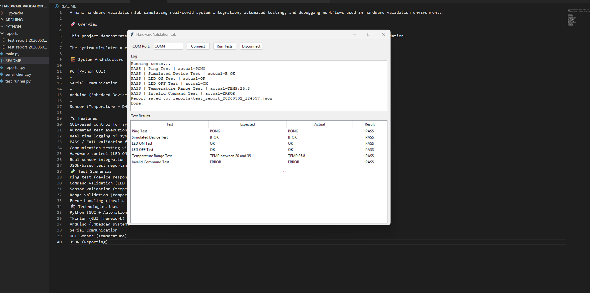

# Hardware Validation Automation Lab

End-to-end hardware validation system simulating real-world lab workflows, including fault injection, sensor validation, and automated test reporting.

---

## 🚀 Overview

This project demonstrates a complete validation flow for an embedded system, combining:

- Hardware ↔ Software integration  
- Automated test execution  
- Real-time system monitoring  
- Fault injection and robustness testing  

The system mimics validation environments used in R&D and production labs.

---

## 🏗️ System Architecture
```
[ PC GUI ]
     │
     ▼
[ Serial Communication ]
     │
     ▼
[ Arduino Device ]
     │
     ▼
[ Temperature Sensor ]
```
---

## 🔧 Key Features

- GUI-based system control (Python + Tkinter)
- Automated test execution (Run All Tests)
- Real-time logging and monitoring
- PASS / FAIL validation framework
- Serial communication protocol testing
- Hardware control (LED ON/OFF)
- Sensor integration (temperature)
- JSON-based reporting
- Fault Injection testing (critical for validation systems)

---

## 🧪 Test Coverage

### Functional Tests
- Ping Test (device responsiveness)
- LED ON/OFF command validation
- Sensor data validation (temperature)

### Validation Tests
- Temperature range validation
- Communication protocol validation

### Fault Injection Tests
- Invalid sensor values (e.g. `TEMP:999`)
- Corrupted messages (e.g. `T#MP:2@.4`)
- Invalid command handling

---

## 🧠 Why This Project Matters

This project simulates real-world responsibilities of a **Validation / Integration Engineer**:

- System-level validation  
- Debugging HW/SW interactions  
- Failure analysis and root cause detection  
- Building automated validation tools  
- Testing system robustness under faults  

---

## 🛠️ Technologies Used

- Python (Automation + GUI)
- Tkinter (GUI framework)
- Arduino (Embedded system)
- Serial Communication (UART)
- DHT Sensor (Temperature)
- JSON (Reporting)

---

## 🖥️ GUI Example



---

## ▶️ How to Run

1. Connect Arduino via USB  
2. Upload Arduino firmware  
3. Run:

```bash
python main.py
```
4. Select COM port  
5. Click **Run Tests**

---

## 📊 Example Output

- PASS / FAIL per test  
- Real-time logs  
- JSON test report generated  